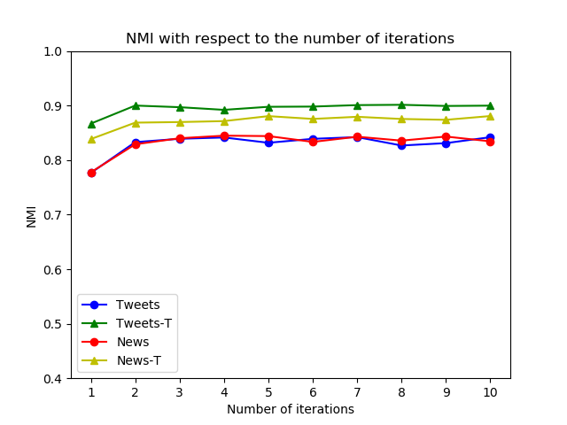
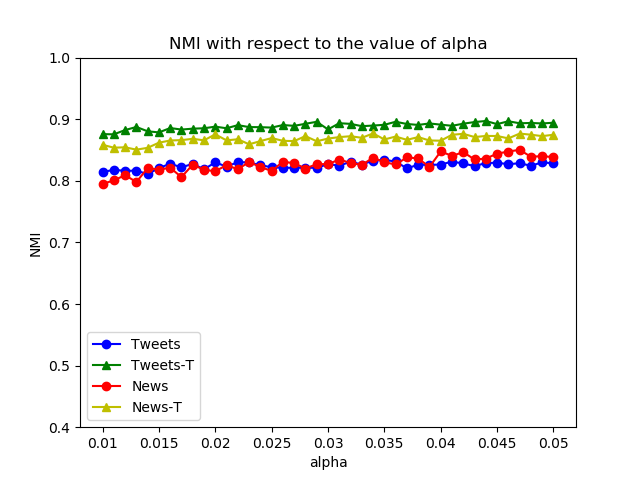
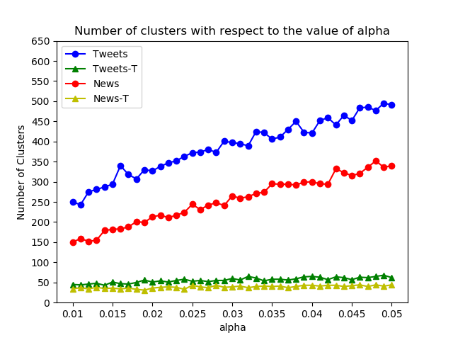
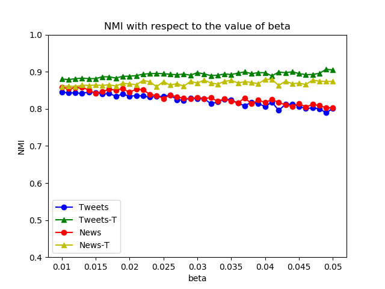
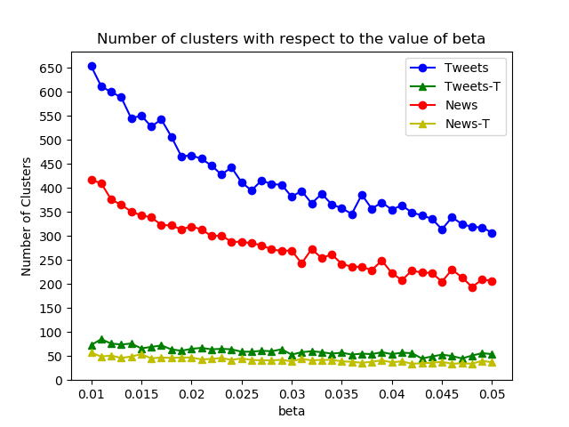
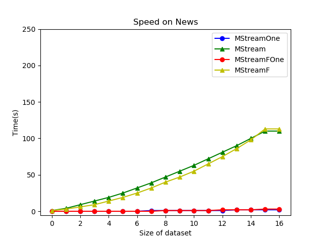
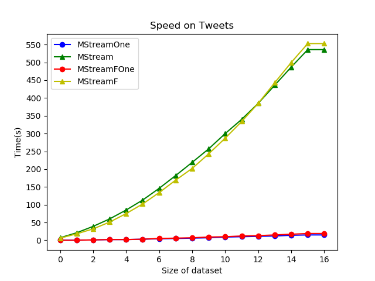

# COP 5725 Course Project: MStream Implementation
Implementation of the paper [Model-based Clustering of Short Text Streams by Yin et al.](https://weizhangltt.github.io/paper/yin-kdd18.pdf) published at KDD 2018

Main alogrithms, MStream and MStreamF, are implemented using C++. Evaluation is implemented in Python.  

## Getting Started

These instructions will get you a copy of the project up and running on your local machine.

### Prerequisites

What things you need to install the software and how to install them

* [g++](https://gcc.gnu.org/)

For evaluation:
* [python 3.6] (https://docs.python-guide.org/starting/install3/linux/)
* numpy. scipy, matplotlib
* scikit-learn

```
sudo apt-get install g++
sudo apt-get install python3.6
python -m pip install --user numpy scipy matplotlib
python -m pip install --user scikit-learn
```
all of the above python packages can be installed using [conda] (https://docs.anaconda.com/anaconda/install/) package manager as well. 

### Installing

Execute the following steps from project root to set up the project structure and build the executable


```
./build_structure.sh
make
```

## Usage

```
Parameters:
*  dataset_name [string], default = 'tweets'
*  useMStreamF [0/1] MStreamF will be used when useMStreamF = 1, default = 0
*  alpha [double], default = 0.03
*  beta  [double], default = 0.03
*  iterations [int]  number of iterations, must be at least 1, default = 2
*  batches_number [int] number of batches the dataset should be split into, must be at least 1, default = 16
*  batches_to_store [int] number of batches to store in case of MStreamF, if using MStream provide a placeholder e.g. 1, default = 1
```

### Running MStream with default parameters on Tweets dataset

```
./mstream
```
### Running MStream with default parameters on other datasets

```
./mstream dataset_name
```

### Running MStream with custom parameters

```
./mstream dataset_name useMStreamF alpha beta iterations batches_number batches_to_store

```
### Running all experiments from the paper
This will take a very long time (over 24 hours), results will be stored in the /result directory

My results can be found here: [results] (https://drive.google.com/open?id=19UY6iPPlfKXlouiRVIS9HnONvuBEsCxL) 

```
./mstream run_all

```

### Examples

```
./mstream
./mstream news
./mstream tweets_t 1 0.025 0.020 5 10 2
```

## Evaluation 
To evaluate single run - calculate the NMI, (assuming that the results are stored in /demo directory)

```
python eval.py dataset_name

```
If all the experiments were executed and results stored in /results directory (or you downloaded my results folder), you can replicate all the plots from the paper by running

```
python eval.py plot_all
```

The plots will be in the /figures directory

## Pre-processing
The original datasets were pre-processed using pre_process.py for the ease of reading them in. Both, original and pre-processed datasets can be found in /data directory. 

## Selected Results









## Authors

* **Daniel Bis** - *Based on* - [Yin et al.](https://weizhangltt.github.io/paper/yin-kdd18.pdf)


